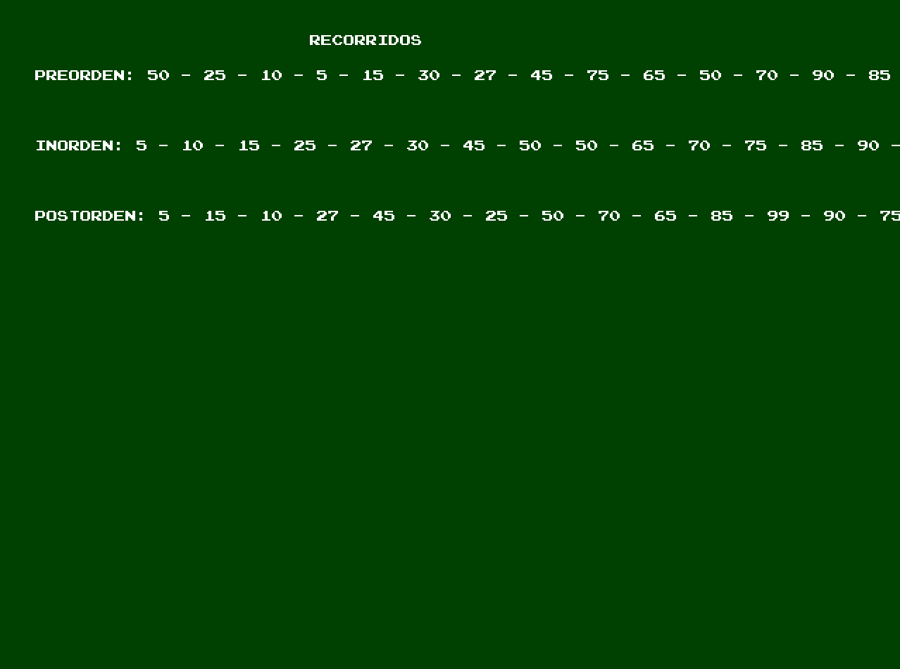
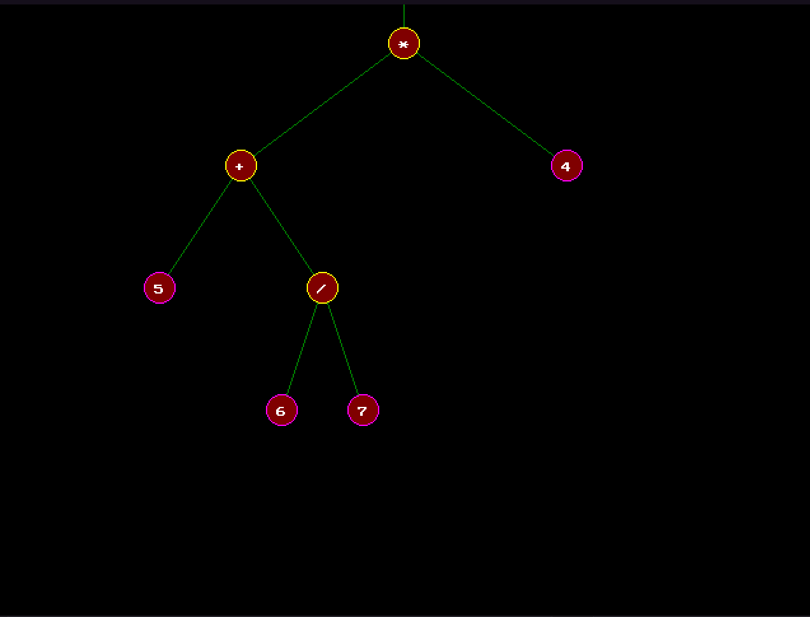
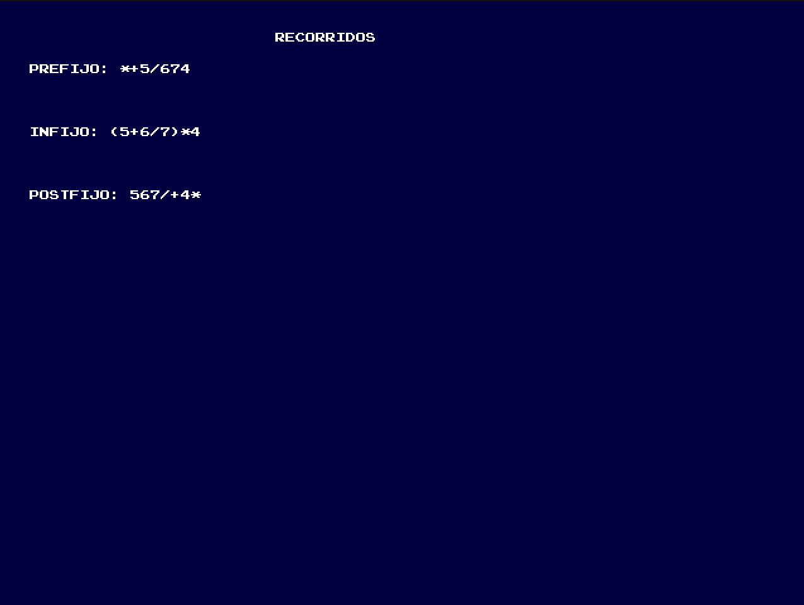

# Arboles Binarios (Estructura de Datos)

Este proyecto fue creado con la intension de ayudar a cualquier persona interesada en el entendimiento de los algoritmos detras de la estrucutura de datos de arboles mediante la visualizacion en tiempo real de los cambios que el usuario haga, ademas de acceso a todo el codigo fuente comentado.

El programa es totalmente grafico y puede ser controlado por el raton o el teclado.

Deja decidir al usuario entre crear un Arbol Binario De Busqueda o un Arbol Binario de Expresion.

Entre los algoritmos usados para el funcionamiento del **arbol binario de busqueda** se encuentran:
* insercion de nodos
* borrar nodos
* Visualizar arbol
* creacion del arbol
* informacion acerca de un nodo:
 1. padre de un nodo
 2. hijos de un nodo
 3. camino mas corto
 4. distancia
 5. grado
 6. nivel
* informacion acerca del arbol:
 1. altura del arbol
 2. nodos hoja
 3. total de nodos
 4. saber si esta completo
* recorridos
  1. PREORDEN
  2. INORDEN
  3. POSTORDEN

  Entre los algoritmos usados para el funcionamiento del **arbol binario de expresion** se encuentran:
  * insercion de expresion (infija)
  * Visualizar arbol
  * creacion del arbol
  * recorridos:
    1. PREFIJO
    2. INFIJO
    3. POSFIJO

## EJEMPLO DE ARBOL BINARIO DE BUSQUEDA

## RECORRIDOS DE ARBOL BINARIO DE BUSQUEDA

## EJEMPLO DE ARBOL BINARIO DE EXPRESION
  

## RECORRIDOS DE ARBOL DE EXPRESION

