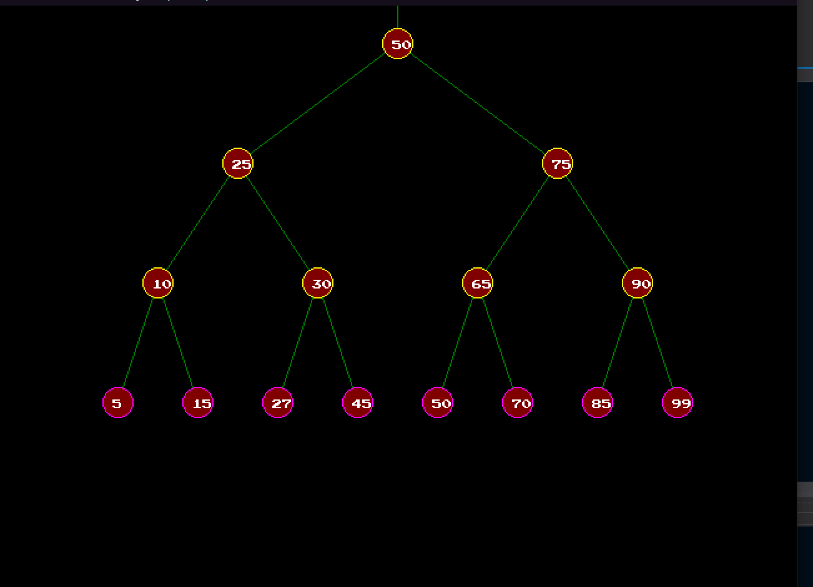
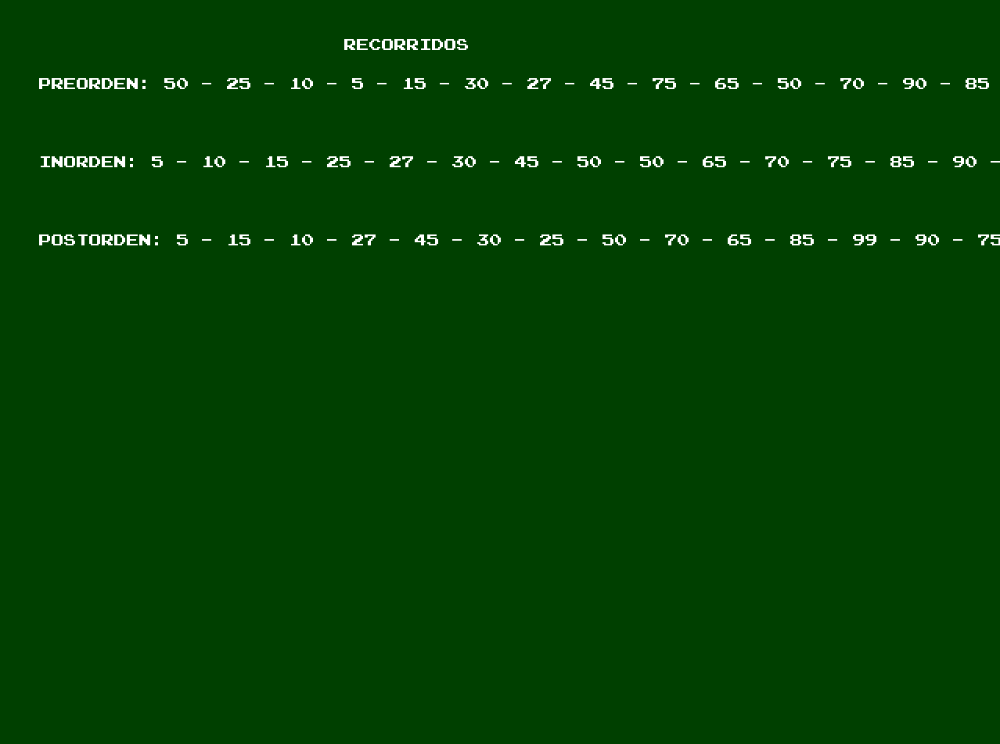
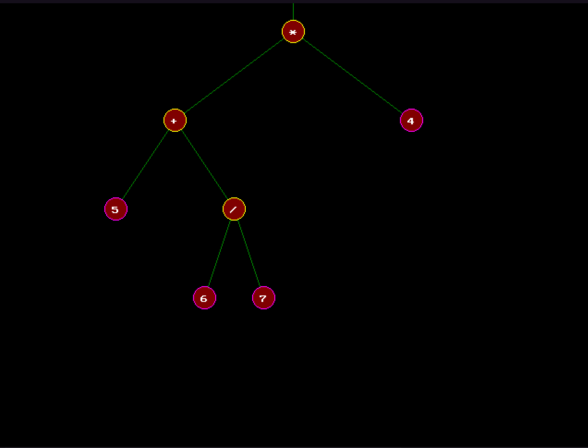
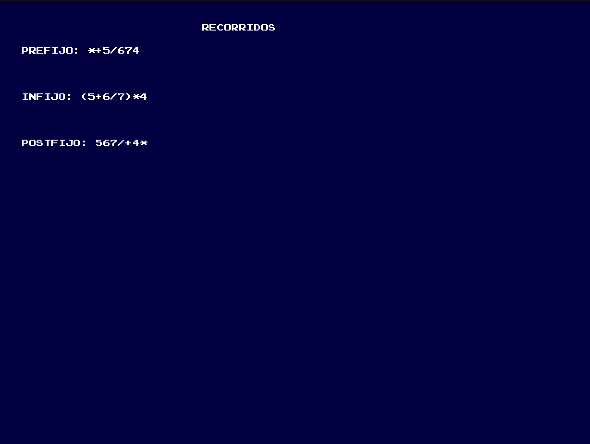

# Binary Trees Data Structure

This proyect was made with the intension of visualize and learn the algorithms behind the __BinaryTrees Data Structure__.

The program lets the user choose, create &amp; visualize between Binary Search Tree &amp; Binary Expression Tree.

The Proyect was made with __olcPixelGameEngine__ &amp; _C++_.

All input can be handle with the mouse and keyboard.

The algorithms choose for the Binary Search Tree are:
* insertion of a node
* deletion of a node
* creation of Tree data structure
* parent of a node
* childs of a node
* GetBrother of a node
* multiple information about the tree itself (height, balanced, leaf nodes, parents nodes, total, etc).
* 3 traversals: pre-order, in-order, post-order.

The algorithms choose for the Binary Expression Tree are:
* Creation of the tree
* insertion of Expression
* balance of Parenthesis in the Expression
* traversals: Pre-fix, In-fix, Post-fix

Both Trees can be visualize in real time, some examples:

## BinarySearchTree

## Traversals

## Binary Expression Tree

## Traversals

